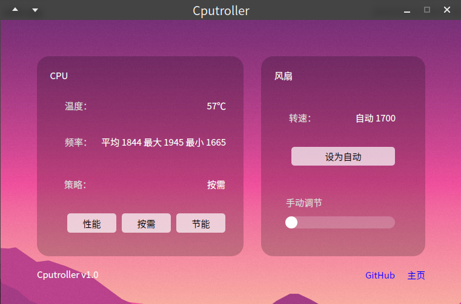

# Cputroller

GNU/Linux 下查看调节 CPU 的策略、风扇转速的图形化工具。

能调节 CPU 的策略为性能、按需、节能模式，能手动调节风扇转速或开启自动调节。

**说明**

本质上只是 cpufrequtils 和内核文件的前端，没有技术含量。

但是命令行的操作对绝大部分普通用户来说不友好，所以把它做成了可视化应用。

**开发环境**

deepin 15.11 ，Qt 5.12.4

**安装方法**

首先需要安装依赖，在终端中运行`sudo apt install -y cpufrequtils`。

然后提供了 3 种程序包，选择合适的一种。

1. [Cputroller](https://github.com/chenghaopeng/Cputroller/releases/download/v1.0/Cputroller)

   单可执行文件，需要系统中有 Qt 5.12.4 。**最轻量，但不推荐。**

2. [Cputroller-x86_64.AppImage](https://github.com/chenghaopeng/Cputroller/releases/download/v1.0/Cputroller-x86_64.AppImage)

   含运行库的可执行文件，能直接运行。

3. [cn.chper.cputroller.deb](https://github.com/chenghaopeng/Cputroller/releases/download/v1.0/cn.chper.cputroller.deb)

   含运行库的可执行文件、快捷方式等的安装包，安装完后可使用。**推荐**

**截图**

**录屏**

**有 BUG 联系我**

QQ：794780360